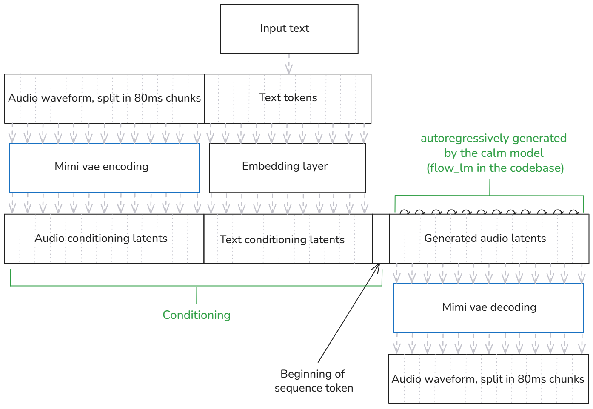

# Contributing to Kyutai Pocket TTS
 
We welcome contributions from the community!

We recommend using `uv` to work on this project. While you can use `pip` too, `uv` is less error-prone and faster.
The instructions below assume you are using `uv`.

## Installing the pre-commit

```bash
uvx pre-commit install
```
This will handle file formatting and linting.

If you want to manually run the pre-commit hooks on all files, use:
```bash
uvx pre-commit run --all-files
```

## Running tests

```bash
uv run pytest -n 3 -v
```
This will run the test suite with 3 parallel workers.

## Running the CLI locally

You can run the CLI commands with:

```bash
uv run pocket-tts generate
```

## Coding agents
We use `AGENTS.md` to manage the coding agents context. If your coding agent does
not supports reading from this file directly, you can just
use a symlink. The most common ones are already added in the `.gitignore` file.

```bash
ln -s AGENTS.md CLAUDE.md
# or
ln -s AGENTS.md QWEN.md
```

## How does this model work?

Here is a high-level overview of the architecture:



Overall the model has four main components:
* The mimi vae encoder, to encode the audio prompts into a latent representation.
* The text "encoder" which is just a simple tokenizer + embedding layer.
* The calm model (`flow_lm` in the codebase) to generate autoregegressive the audio latents.
* The mimi vae decoder to decode the audio latents into waveform.

Note that two threads run in parallel in the current implementation:
* One with the calm model generating the latents.
* One with the mimi vae decoder decoding the latents into audio.


## About the overall process

### What gets accepted
Feel free to open PRs. We can only promise that we'll accept PRs that:
* Fix bugs
* Add a feature that was previously asked for, in an issue, by a member of our team.
* Has a high enough quality (this is the purpose of the code review, so don't worry too much about it)

Even if the PR is not accepted because we cannot maintain it, we can still add a note to the README.md about your work and how to use it. We'll just link to your repository. This is the case for example for alternative implementations of Pocket TTS.

### Issues etiquette

We don't assign people to issues. Everyone is free to work on any issue they want,
and free to open a PR to even propose an alternative implementation of a feature.

We want to avoid the [Cookie licking problem](https://www.redhat.com/en/blog/dont-lick-cookie). The situation where a contributor answers an issue saying "I want to work on this issue" or "Can I work on this issue?" is not as polite as it might seem. While the intent is good, because obviously two people making the same pull request at the same time can lead to frustation, claiming an issue can have the following negative effects:
* It puts pressure on the contributor to actually deliver something in a timely manner, which can lead to lower quality contributions or stress.
* Sometimes, life happens, open source is not our only focus, and the contributor cannot work on the issue anymore. This can lead to the issue being blocked for a long time, which is bad for the project and creates frustration for contributors.
* It can discourage other contributors to try different approaches to solve the same issue because they think someone else is already working on it, and they believe they should not "step on toes".
* Monitoring blocked issues is additional work for maintainers.

To avoid those problems, we adopt the following rules:
* Anyone is free to work on any issue at any time.
* If someone asks something along the lines of "Can I work on this issue?" or "I'm working on this", we will remind the rules and delete the comment to avoid confusion.
* If two people open a PR solving the same issue, we will review both and choose the one that is the best fit for the project.
* If two people open very similar PRs, one of them will be merged and they'll both be credited in the commit message.

This way, we ensure that the project moves forward as fast as possible, and that contributors can work on what they want without pressure or stress.

Of course, this does not apply to contributors asking for help or guidance on how to solve an issue. We'll just ask you to focus on asking information and avoid saying that you're working on it.

## Pull request etiquette

* While some pull requests are inevitably large, we recommend keeping them as small as possible. This makes the review process easier, faster, as well as more enjoyable. Always consider splitting large PRs into smaller ones.
* Pull requests are always squashed when merged, so don't worry about cleaning up your commit history, don't even worry about the commit messages. Just focus on making sure the PR is easy to review and small enough.
